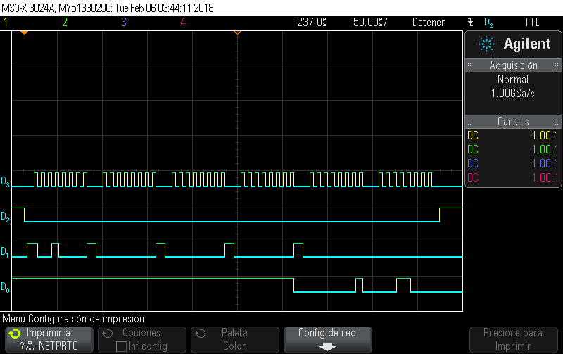

# Comunicación SPI / Memoria Flash

Se trabaja en generar una librería en C para la extracción y guardado de datos en la memoria flash **S25FL256S** [Datasheet](./_docs/001-98283_S25FL128S_S25FL256S_128_MBIT_16_MBYTE_256_MBIT_32_MBYTE_3.0V_SPI_FLASH_MEMORY.pdf) incluída en la CLU. Se utiliza el NIOS II para la transacción de datos por software.

## Pruebas Iniciales

Se envía el comando de identificación **Read Identification - REMS (Read_ID or REMS 90h). **Para esto se envían 8 bits correspondientes a la instrucción 0x90 y 24 bits de ceros. La respuesta esperada en 2 sets de 8 bits se obtiene del datasheet:


Se ejecuta una pequeña rutina en NIOS II para verificar una implementación básica. 

La salida de la consola de NIOS II se obtiene de la siguiente forma:

```
Hello from Nios II!
90 0 0 0
1 18
```

Acá los valores corresponden a datos *uint8* enviados y datos en *uint8* recibidos respectivamente.

Las señales de la comunicación SPI se observan en la siguiente imagen. SPI Clock, SPI Chip Select, SPI MOSI y SPI MISO respectivamente.




## Funcionalidad básica lectura/escritura

Se construye una pequeña librería (wrapper de funciones de Altera) para leer datos de la memoria flash. La interfaz tiene como funciones principales **write_memory()** y **read_add()** que contienen los pasos necesarios en termino de modificación de registros y limpieza de sectores para la lectura/escritura de datos. Esto se ve a continuación.

```c
   1 // *** MAIN INTERFACE ***
   2 
   3 // main functions
   4 void read_id();
   5 void sector_erase(uint32_t add);
   6 void write_memory(uint32_t add, uint8_t value);
   7 uint8_t read_add(uint32_t add);
   8 
   9 // status register related functions
  10 void write_enable(); // ** write enable se deshabilita después de cada
  11 // funcion de escritura (revisar 8.2 write enable command en 8. Data Protection)
  12 void write_disable();
  13 void clear_status_register();
  14 uint8_t read_status_register();
  15 void check_write_enable(bool value_target);
  16 void check_write_in_progress();
  17 
  18 // auxiliary functions
  19 void split_32_to_8_bits(uint32_t number, uint8_t * pointer);

```

La librería se prueba con un programa que ejecuta los siguientes pasos:

- Identificación del módulo ocupando **read_id**
- Lectura de un sector de memoria
- Activación de **write_enable** y limpieza de sector de memoria
- Activación de **write_enable** y escritura a sector de memoria
- Corroborar los datos leyendo el sector de memoria

```
SPI FLASH INTERFACE!

*** CLEAR STATUS REGISTER ***

*** READ_ID ***
90 0 0 0 
1 18 

*** READ ADDRESS ***
13 1 ff f0 0
25

*** Write to memory ***

*** Write enable ***

*** Clear memory sector ***
dc
 1 ff f0 0

*** Write enable ***
12
 1 ff f0 0
 23

*** READ ADDRESS ***
13 1 ff f0 0
23
Status Register: 0


*** READ_ID ***
90 0 0 0 
1 18 

*** READ ADDRESS ***
13 1 ff f0 0
23

*** Write to memory ***

*** Write enable ***

*** Clear memory sector ***
dc
 1 ff f0 0

*** Write enable ***
12
 1 ff f0 0
 24

*** READ ADDRESS ***
13 1 ff f0 0
24
Status Register: 0
```